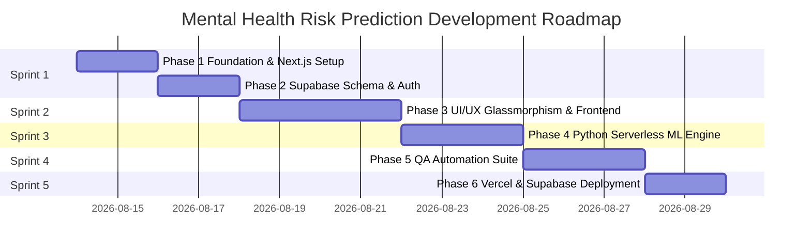

# Product Requirement Document (PRD) 🧠
## Mental Health Risk Prediction & Assessment Platform

---

## 1. Document Control & Metadata

| Attribute | Details |
| :--- | :--- |
| **Product Name** | Mental Health Risk Prediction Platform |
| **Version** | 2.0.0 (Vercel & Supabase Edition) |
| **Status** | In Development / Ready for Build |
| **Author** | Senior Fullstack Web & AI Engineer |
| **Target Infrastructure** | Vercel (Frontend & Python Serverless), Supabase (PostgreSQL & Auth) |
| **Repositories** | `https://github.com/adjiehf231/mental_health_risk_predictions` |
| **Cross References** | [README.md](README.md) \| [guide_deploy.md](guide_deploy.md) \| [qa_automation.md](qa_automation.md) |

---

## 2. Product Overview & Vision

### 2.1 Problem Statement
Mental health issues often go unnoticed until they become acute due to a lack of accessible, real-time risk assessment tools. Existing solutions are either overly clinical, non-interactive, or lack evidence-based machine learning models combined with scalable cloud infrastructure.

### 2.2 Product Vision
To build an intuitive, visually captivating, highly accessible, and accurate **Mental Health Risk Assessment Web Application** powered by Machine Learning (99.5% Decision Tree accuracy). The platform delivers real-time risk predictions, interactive data exploration (EDA), model benchmarking, and assessment tracking integrated with **Supabase PostgreSQL** and deployed globally via **Vercel**.

---

## 3. Target Audience & User Personas

### Persona 1: Individual Assessment User (Patient / Self-Checker)
- **Goal**: Quickly evaluate personal mental health risk level based on lifestyle, stress, sleep, and emotional scores.
- **Needs**: Simple sliders/selects, instant clear feedback, actionable recommendations, privacy-focused assessment logs.

### Persona 2: Healthcare Practitioner / Counselor
- **Goal**: Review patient assessment history, evaluate probability distributions, and inspect key contributing risk factors.
- **Needs**: Accurate confidence metrics, printable summary/export, history log tracking.

### Persona 3: Data Scientist / ML Developer
- **Goal**: Review dataset distributions, evaluate algorithm performance (Decision Tree vs. Random Forest vs. SVM), and audit feature selection metrics.
- **Needs**: Interactive EDA charts, model accuracy comparisons, preprocessing audit logs.

---

## 4. Development Phases & Agile Sprint Roadmap



### 🏃 Sprint 1: Architecture Foundation & Database Setup (Days 1–4)
- **Phase 1: Project Initialization & Next.js Structure**
  - Initialize Next.js 14/15 App Router with TypeScript and Tailwind CSS.
  - Setup glassmorphic design system tokens, fonts, and dark/light color themes in `app/globals.css` and `tailwind.config.js`.
  - Create core layout shell (`components/Navbar.tsx`, `components/Footer.tsx`).
- **Phase 2: Supabase Schema & Data Layer Integration**
  - Write `supabase_schema.sql` for PostgreSQL database creation (`assessments` table, RLS policies, indexing).
  - Implement Supabase TypeScript client (`lib/supabase.ts`) with offline fallback support.

### 🏃 Sprint 2: Modern UI/UX & Interactive Pages (Days 5–8)
- **Phase 3: Frontend Feature Development**
  - **Landing Page (`app/page.tsx`)**: Hero section, animated metric stats, feature cards, CTA.
  - **AI Risk Predictor (`app/prediction/page.tsx`)**: 15 input sliders/selects, real-time feedback, risk score gauge, interactive Recharts probability breakdown.
  - **EDA Data Dashboard (`app/dashboard/page.tsx`)**: Interactive graphs for dataset distributions, correlations, age vs. stress, demographics.
  - **ML Models & Preprocessing (`app/models/page.tsx`)**: Model comparison table (Decision Tree, Random Forest, SVM, KNN, Naive Bayes), feature selection ranking.
  - **Assessment History (`app/history/page.tsx`)**: Supabase assessment records, search, risk filter, CSV export.

### 🏃 Sprint 3: Serverless ML Inference Engine (Days 9–11)
- **Phase 4: Vercel Python Serverless Engine**
  - Construct `/api/py/index.py` serverless endpoint loading `models/best_model.pkl`, `scaler.pkl`, `selector.pkl`, `encoder.pkl`.
  - Validate input payload parsing, feature scaling, prediction, and confidence probability outputs.

### 🏃 Sprint 4: QA Automation & E2E Testing (Days 12–14)
- **Phase 5: Automated Testing Framework**
  - Configure **Playwright** (`playwright.config.ts`) for cross-browser testing (Chromium, Firefox, WebKit).
  - Implement E2E test suites (`e2e/prediction.spec.ts`, `e2e/navigation.spec.ts`).
  - Implement API verification suite (`e2e/api.spec.ts`) for `/api/py/predict`.
  - Set up GitHub Actions CI workflow (`.github/workflows/qa_ci.yml`).

### 🏃 Sprint 5: Production Launch & Deployment (Days 15–16)
- **Phase 6: Vercel Deployment & Supabase Production Sync**
  - Deploy frontend and serverless API to Vercel.
  - Connect Supabase production credentials.
  - Perform live verification and post-deployment audits (refer to [guide_deploy.md](guide_deploy.md)).

---

## 5. System Architecture & Tech Stack

```mermaid
graph TD
    User([User Device]) <-->|HTTPS / Responsive UI| NextJS[Next.js 14/15 App Router]
    NextJS <-->|Next.js API Route / Serverless| PyAPI[Vercel Python ML Engine]
    PyAPI <-->|scikit-learn Inference| MLModels[joblib Models: DT, Scaler, Selector]
    NextJS <-->|@supabase/supabase-js| Supabase[(Supabase PostgreSQL)]
    Playwright[Playwright QA Automation] -->|E2E Test Suites| NextJS
```

### Technical Stack Components:
- **Frontend Framework**: Next.js 14/15 (App Router, TypeScript)
- **UI & Design System**: Tailwind CSS, Glassmorphism design tokens, Framer Motion animations, Lucide React icons
- **Data Visualization**: Recharts / Chart.js for interactive responsive graphs
- **ML Serverless Backend**: Vercel Python Serverless Runtime (`scikit-learn`, `joblib`, `numpy`, `pandas`)
- **Database & Auth**: Supabase PostgreSQL (`assessments`, `dataset_stats`)
- **QA & Testing**: Playwright E2E Automation, Vitest Component Unit Tests

---

## 6. Functional Requirements & Feature Specifications

### 6.1 AI Risk Assessment Engine (`/prediction`)
- **Top 15 Features Input Interface**:
  - Demographics: Age, Gender, Marital Status, Education Level, Employment Status.
  - Lifestyle & Health: Sleep Hours, Physical Activity (hrs/wk), Screen Time (hrs/day), Substance Use.
  - Psychological & Stress Indicators: Anxiety Score (0-10), Depression Score (0-10), Work Stress Level (0-10), Job Satisfaction Score (0-10), Financial Stress Level (0-10), Social Support Score (0-10), Panic Attack History, Family History.
- **Real-time Serverless Prediction API**:
  - Submits inputs to `/api/py/predict`.
  - Performs LabelEncoding, SelectKBest transformation, and StandardScaler normalization.
  - Runs Decision Tree classifier (`best_model.pkl`).
- **Interactive Results Display**:
  - Semantic Risk Level Badge (Low Risk: Green, Moderate Risk: Amber, High Risk: Red).
  - Confidence Percentage Gauge.
  - Interactive Recharts Risk Probability Breakdown (Low / Moderate / High probabilities).
  - Customized Actionable Recommendations based on risk classification.
  - Auto-save assessment to Supabase database.

### 6.2 EDA Data Dashboard (`/dashboard`)
- **Dataset Summary Cards**: Total records (25,000+), Total features (26 raw, 15 selected), Target distribution.
- **Interactive Visualizations**:
  - Risk Level Distribution Pie / Bar Chart.
  - Age vs. Stress Level Area/Scatter plot.
  - Anxiety vs. Depression Correlation Matrix.
  - Gender & Education Demographics breakdown.

### 6.3 Machine Learning Benchmark Explorer (`/models`)
- **Algorithm Comparison Grid**:
  - Decision Tree (C4.5) - Accuracy: 99.5%, F1-Score: 99.3% ⭐ Best Model
  - Random Forest - Accuracy: 97.2%
  - Naive Bayes - Accuracy: 89.4%
  - KNN - Accuracy: 91.8%
  - SVM - Accuracy: 93.5%
- **Preprocessing Pipeline Metrics**:
  - IQR Outlier Capping details.
  - SelectKBest feature scoring chart.

### 6.4 Assessment History & Data Log (`/history`)
- **Supabase Integration**: Real-time table display of stored patient assessments.
- **Filtering & Search**: Filter by Risk Level (Low/Moderate/High) and date ranges.
- **Data Export**: Export assessment logs as CSV for clinical review.

---

## 7. UI/UX & Design Guidelines

- **Design Style**: Modern Glassmorphism (`backdrop-blur-lg`, `border-white/10`, sleek translucent cards).
- **Color Palette**:
  - Dark Theme Background: `#0f172a` (Slate-900) to `#1e1b4b` (Indigo-950) gradient.
  - Accent Primary: `#6366f1` (Indigo-500) to `#8b5cf6` (Purple-500).
  - Success (Low Risk): `#10b981` (Emerald-500).
  - Warning (Moderate Risk): `#f59e0b` (Amber-500).
  - Danger (High Risk): `#ef4444` (Red-500).
- **Responsive Behavior**: Fluid mobile-first layout adaptively scaling from 1-column on mobile viewports to 5-column grids on wide desktop screens.
- **Accessibility**: Keyboard focus rings, screen-reader friendly labels (`aria-label`), contrast ratio > 4.5:1.

---

## 8. QA Automation Strategy

Refer to [qa_automation.md](qa_automation.md) for complete QA specifications.
- **Playwright End-to-End (E2E)**: Form Slider interaction, route navigation, history sync.
- **API Endpoint Automation**: HTTP API test suite for `/api/py/predict`.
- **Vitest Unit Tests**: Component rendering and utility functions.

---

## 9. Non-Functional Requirements & Release Criteria

- **Performance**: Page load time (LCP) under 1.2s; serverless prediction response latency under 250ms.
- **Scalability**: Stateless Next.js frontend + Vercel serverless execution.
- **Data Security**: Supabase environment variables isolation; strict Row Level Security (RLS) policies.
- **Deployment**: Follow deployment steps in [guide_deploy.md](guide_deploy.md).
