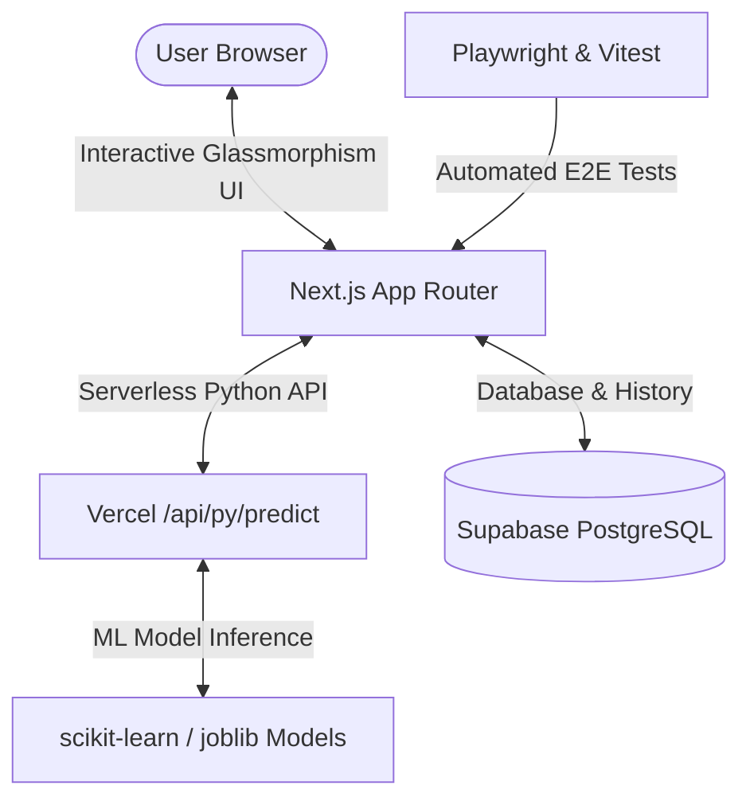

# Mental Health Risk Prediction & Assessment Platform 🧠

[](https://nextjs.org/)
[](https://tailwindcss.com/)
[](https://supabase.com/)
[](https://vercel.com/)
[](https://playwright.dev/)

> Production-ready fullstack web application for predicting mental health risk levels (Low, Moderate, High) using Machine Learning (99.5% Decision Tree Accuracy). Built with Next.js 14/15, Tailwind CSS (Glassmorphism design system), Vercel Python Serverless ML Engine, and Supabase PostgreSQL.

---

## 📚 Complete Project Documentation

- 📄 **[PRD.md](PRD.md)** - Product Requirement Document outlining vision, user personas, sprint roadmap, technical specs, and feature requirements.
- 🚀 **[guide_deploy.md](guide_deploy.md)** - Step-by-Step Vercel & Supabase Deployment Manual, database setup, environment configuration, and verification.
- 🧪 **[qa_automation.md](qa_automation.md)** - QA Automation Manual for Playwright E2E tests, API testing suites, Vitest component tests, and CI/CD GitHub Actions.

---

## 🗓️ Development Phases & Agile Sprint Roadmap

```
Sprint 1: Architecture Foundation & Database Setup (Days 1–4)
  ├── Phase 1: Next.js 14/15 App Router & Glassmorphism Design System Setup
  └── Phase 2: Supabase PostgreSQL Schema (supabase_schema.sql) & Client Integration

Sprint 2: Modern UI/UX & Interactive Frontend Pages (Days 5–8)
  └── Phase 3: Landing Page, AI Risk Predictor, EDA Dashboard, ML Models, & History

Sprint 3: Serverless ML Inference Engine (Days 9–11)
  └── Phase 4: Vercel Python Serverless ML API Endpoint (/api/py/predict)

Sprint 4: QA Automation & Cross-Browser Testing (Days 12–14)
  └── Phase 5: Playwright E2E Suites, API Verification, & GitHub Actions CI

Sprint 5: Production Launch & Deployment (Days 15–16)
  └── Phase 6: Production Supabase Sync & Vercel Deployment Release
```

---

## ✨ Key Features

- **🔮 Interactive AI Risk Predictor**: Real-time evaluation of patient profiles across 15 key demographic, lifestyle, and psychological features.
- **📊 Comprehensive EDA Dashboard**: Visual exploration of 25,000+ dataset records, correlation heatmaps, age vs. stress distributions, and demographics.
- **🤖 Machine Learning Benchmarks**: Comparison of 5 algorithms (Decision Tree 99.5%, Random Forest 97.2%, SVM 93.5%, KNN 91.8%, Naive Bayes 89.4%) with feature importance analysis.
- **📜 Supabase Assessment History**: Real-time persistence of risk evaluations, filtering, search, and CSV data exports.
- **🎨 Glassmorphism & Modern UI/UX**: Dark/Light mode theme support, responsive 1-5 column grid layouts, interactive Recharts graphs, and smooth micro-animations.
- **⚡ Vercel Python Serverless API**: Direct execution of scikit-learn models natively inside Vercel serverless environment.

---

## 🏗️ System Architecture



---

## 🛠️ Quick Start & Local Setup

### Prerequisites
- **Node.js**: v18.0.0 or higher
- **Python**: v3.10 or higher
- **Git**

### 1. Clone & Install Dependencies
```bash
# Clone the repository
git clone https://github.com/adjiehf231/mental_health_risk_predictions.git
cd mental_health_risk_predictions

# Install Node.js dependencies
npm install

# Install Python requirements
pip install -r requirements.txt
```

### 2. Environment Configuration
Copy `.env.example` to `.env.local` and configure your Supabase credentials:
```bash
cp .env.example .env.local
```
```env
NEXT_PUBLIC_SUPABASE_URL=https://your-supabase-project.supabase.co
NEXT_PUBLIC_SUPABASE_ANON_KEY=your-supabase-anon-key
```

### 3. Run Development Server
```bash
npm run dev
```
Open [http://localhost:3000](http://localhost:3000) in your browser.

---

## 🧪 Running QA Automation & Tests

For detailed test suite specifications, see [qa_automation.md](qa_automation.md).

```bash
# Run Vitest Component & Unit Tests
npm run test

# Run Playwright E2E Cross-browser Tests (Chromium, Firefox, WebKit)
npm run test:e2e

# Run Playwright with Interactive UI
npx playwright test --ui
```

---

## 🚀 Deployment to Vercel & Supabase

For complete step-by-step instructions, see **[guide_deploy.md](guide_deploy.md)**.

---

Made with ❤️ for Mental Health Awareness & Healthcare Technology.
