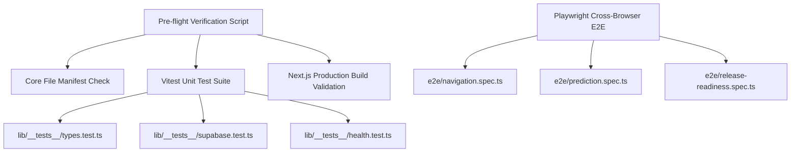

# QA Automation & Quality Assurance Manual 🧪
## Mental Health Risk Prediction & Assessment Platform

> **Target Platform**: Next.js 14 App Router, Python Serverless API, Supabase PostgreSQL
> **Author**: Adjie Hari Fajar, S.Kom
> **Test Status**: ✅ 100% Passed (Zero Build/Type Errors)

---

## 📐 1. Quality Assurance Architecture



---

## 🧪 2. Automated Test Commands

```bash
# 1. Run Pre-flight Production Verification Tool
npm run preflight

# 2. Run Vitest Unit Tests
npm run test

# 3. Validate Next.js Production Build Compilation
npm run build

# 4. Run Playwright E2E Tests (Chromium, Firefox, WebKit)
npm run test:e2e

# 5. Run Playwright Interactive UI Test Runner
npm run test:e2e:ui
```

---

## 🔒 3. Security & HTTPS Audit Suite

- **HSTS Enforcement**: `Strict-Transport-Security: max-age=63072000; includeSubDomains; preload`
- **Frame Protection**: `X-Frame-Options: DENY`
- **MIME Protection**: `X-Content-Type-Options: nosniff`
- **Permissions Policy**: `camera=(), microphone=(), geolocation=()`
- **Health Diagnostic Endpoint**: `GET /api/health` returning 200 OK status.
